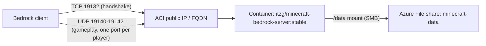

# Minecraft Bedrock server on Azure Container Instances (Terraform lab)

This is a learning lab. I was studying for the Terraform Associate (004) exam and wanted a real project instead of only tutorial resources, so I used Terraform to run a Minecraft Bedrock Dedicated Server on Azure Container Instances (ACI), with the world saved on an Azure File share.

I work in IT support and I'm AZ-104 certified, but I'm new to writing code, and I'm not a Minecraft server admin or a networking expert.

I've played Minecraft since I was about nine, across Pocket Edition, PC, Bedrock, and most other platforms, and I've messed around with modding over the years. Around 2016, when I was 12 or 13, I tried to set up my own server. I got as far as logging in to my family's router, didn't know what to do next, and gave up. This project is me finally getting there about ten years later, this time with Terraform and Azure. A lot of this repo is me writing down what broke and what I found out along the way. If something here is wrong or there's a better way, that's very possible.

It works: I've joined it from a Windows Bedrock client and the world survives restarts. There are some real limitations, listed under [Known issues](#known-issues).

## How I built this (and where I had help)

I used Claude Code (an AI coding assistant) as a tutor for this project. Here's who did what:

| Me | Claude Code |
|---|---|
| Wrote the Terraform for the resource group, storage account, file share, and container group, including the `dynamic "ports"` block, using the HashiCorp and Microsoft docs | Explained concepts, reviewed my code and plans, and told me which docs to read |
| Ran `terraform plan` / `apply` and read the plans | Wrote the liveness probe block and the creative-mode settings; I added them and applied them |
| Joined the server and tested that the world persisted | Did most of the troubleshooting when the server wouldn't connect: ran checks inside the container, found the NetherNet change and the Mojang bug |
| Noticed the log pattern that led to the startup-race finding | Made the manual `server.properties` edits (the `server-udp-ports` line) |
| Reviewed these docs | Drafted these docs from my notes and our session |

Why Claude made the `server.properties` edits: it was simpler to change the file in place, using `az container exec` to reach into the running container, than to go through Terraform. A Terraform change would have redeployed (replaced) the container group, and that gives it a new public IP, which is the value the line needs. So the line would have been out of date again straight away. Editing it in place and then restarting the container usually kept the same IP during my testing, though Microsoft says a restart can change it.

I tried to work things out myself before asking. The core HCL (resources, references, nested blocks) was stuff I could write. The `dynamic` block was new to me, since I hadn't studied it yet. I was given its general shape and filled it in myself. Most of what I needed help with was container- and Minecraft-specific, not Terraform.

I'm including this because I'm still learning, and I want to be clear about what I can do on my own and where I needed help.

## Architecture



Plain text version:

```
Bedrock client
   |  TCP 19132         (connection handshake)
   |  UDP 19140-19142   (gameplay, one port per connected player)
   v
ACI public IP / FQDN  ->  container "minecraft"
                              |
                              | /data
                              v
                       Azure File share "minecraft-data"
                       (world, server.properties, etc.)
```

The guide I started from assumed the older setup where everything goes over UDP 19132. Newer Bedrock versions use a different transport (NetherNet), which is why the ports look the way they do. The details are in [docs/journey.md](docs/journey.md).

## What gets deployed

All of this is in `main.tf`:

| Resource | Details |
|---|---|
| Resource group | `rg-mc-bedrock-lab` in `eastus2` |
| Storage account | `StorageV2`, `Standard`, `LRS` |
| File share | `minecraft-data`, 10 GiB quota, SMB, referenced by `storage_account_id` |
| Container group | `aci-mc-bedrock-lab`, Linux, public IP, DNS label, restart policy `Always` |
| Container | `minecraft`, image `itzg/minecraft-bedrock-server:stable`, 2 vCPU, 4 GB |
| Ports | TCP 19132, plus UDP 19140, 19141, 19142 (generated with a `dynamic "ports"` block and `range(19140, 19143)`) |
| Volume | The file share mounted at `/data`; the storage key comes from a reference to the storage account, not pasted in |
| Liveness probe | Checks `/proc/net/tcp` and `/proc/net/tcp6` for a listening socket on port 19132, so ACI restarts the container if a boot comes up without it (see Known issues) |

Server settings are passed as environment variables (the image writes them into `server.properties`). Right now they set creative mode with `FORCE_GAMEMODE`, max 5 players, `ONLINE_MODE = "false"`, and a world named `terraform-world`.

Things that are hardcoded in this version: the resource names, region, DNS label, and storage account name (storage account names are global, so you would have to change it). `variables.tf` is currently empty. Moving these into variables is on my to-do list, so there's no `terraform.tfvars.example` yet.

`outputs.tf` outputs the container group name, its ID, and the exposed ports. It doesn't output the IP or FQDN yet, so I get those from `az container show` (below).

## Prerequisites

- An Azure subscription where you can create resource groups, storage accounts, and container instances
- Azure CLI
- Terraform (I used 1.16.x; the provider is `hashicorp/azurerm ~> 4.0`, and the lock file has 4.81.0)
- A Bedrock client that can add a custom server (I used Windows)

## Deploy

```powershell
az login
az account set --subscription "<subscription-id>"
$env:ARM_SUBSCRIPTION_ID = "<subscription-id>"

terraform init
terraform fmt
terraform validate
terraform plan -out="deploy.tfplan"
terraform apply "deploy.tfplan"
```

AzureRM v4 needs the subscription ID set explicitly; the environment variable is how I did it so it isn't in any file.

Check that it's running and get the public IP:

```powershell
az container show -g rg-mc-bedrock-lab -n aci-mc-bedrock-lab --query "{state:instanceView.state,ip:ipAddress.ip,fqdn:ipAddress.fqdn,ports:ipAddress.ports}" -o json
az container logs -g rg-mc-bedrock-lab -n aci-mc-bedrock-lab --container-name minecraft
```

A good boot logs `Server started` and also `Accepting clients on [::]:19132`. If that second line is missing, nobody can join (see [troubleshooting](docs/troubleshooting.md)).

## Manual step after deploying

This is the part Terraform doesn't do. Behind ACI the server only knows its private IP, so it needs to be told the public IP to hand out to clients for the UDP gameplay ports.

1. Get the public IP from the `az container show` command above.
2. In the portal, open the storage account, then the `minecraft-data` share, and edit `server.properties` (it's at the root of the share, which is `/data` in the container).
3. Set this line (replace the placeholder with the real IP):

   ```
   server-udp-ports=<PUBLIC_IP>:19140-19142:19140-19142
   ```

4. Restart:

   ```powershell
   az container restart -g rg-mc-bedrock-lab -n aci-mc-bedrock-lab
   ```

You have to redo this whenever the container group gets **replaced**, because a replacement gets a new public IP. In Terraform, changing the name, environment variables, or ports causes a replace. Microsoft's docs also say the IP **can change on `restart`, `stop`/`start`, or platform maintenance**, so check the IP after any of those. I initially thought only a replacement changed it, but that's wrong.

This setting sticks because the image doesn't have an environment variable for it. Settings that do have an environment variable get rewritten from the env vars every time the container starts, so editing those in the file doesn't last; change them in `main.tf` instead.

## How to join

In Bedrock: Play > Servers > Add Server.

- Server address: the FQDN from `az container show` (or the public IP)
- Port: `19132`

## Cost

Roughly **$0.12 per hour** for 2 vCPU / 4 GB of ACI compute while the container is running, whether or not anyone is playing. That's from Microsoft's published per-second ACI rates, not my bill, so check pricing for your region. Storage (the share and its transactions) is extra but small for this.

To pause and keep the world:

```powershell
az container stop  -g rg-mc-bedrock-lab -n aci-mc-bedrock-lab
az container start -g rg-mc-bedrock-lab -n aci-mc-bedrock-lab
```

## Removing it

```powershell
terraform plan -destroy
terraform destroy
```

**Warning:** destroy deletes the storage account too, which means the world is deleted. Download the world folder from the share first if you want to keep it.

## Known issues

- **Online mode is off.** Connections fail with `online-mode=true` because of a Mojang bug, [BDS-23108](https://mojira.dev/BDS-23108). With it off there's no Xbox account authentication, so anyone who has the address can join as any name. I don't leave it running unattended because of this. I'll turn it back on once the bug is fixed.
- **The public IP is hardcoded in `server-udp-ports`**, and the IP changes when the container group is replaced. Forgetting to update it means people can't connect.
- **About 3 players at a time.** NetherNet uses one UDP port per player, and ACI allows at most 5 ports per IP. With TCP 19132 plus 3 UDP ports I'm using 4. I could probably add one more.
- **IPv4 only.** ACI doesn't give an IPv6 address.
- **Startup race.** Some boots log `Server started` but never open the TCP listener on 19132. I don't know the root cause. The liveness probe works around it by restarting the container when the port isn't listening.
- **Logs are lost when the container is replaced.** `az container logs` only shows the current container. Sending logs to Log Analytics would fix this; I haven't done it.
- **Possible v2:** a small VM with a static public IP would avoid the IP problem and the port cap, at the cost of managing a VM.

## What's next

I may redo this on a small VM instead of ACI. A VM with a static public IP would avoid the IP problem and the 5-port cap, and it's probably more convenient for me since VMs are closer to what I already know from Azure. A small VM also costs about the same as (or less than) this ACI setup.

More generally, I want to use this as an ongoing lab platform for Terraform and Azure. Minecraft is a game, but to Azure it's just an application: it has compute, storage, networking, state that has to persist, and a clear way to check it works (can someone join, and is the world still there). The same deploy-and-validate loop would apply to any app, like an API or a line-of-business workload. Since the Terraform lives on my machine, I can redeploy, change, and break things whenever I want. I haven't decided what I'll add next, so I'm not listing specific plans here.

## More docs

- [docs/journey.md](docs/journey.md) - what happened, in order, including the mistakes
- [docs/troubleshooting.md](docs/troubleshooting.md) - symptoms, what I checked, what it turned out to be, and useful commands
- [docs/lessons-learned.md](docs/lessons-learned.md) - Terraform and Azure takeaways

## Sources

- Mojang bug tracker, BDS-23108: https://mojira.dev/BDS-23108
- itzg/docker-minecraft-bedrock-server (the container image): https://github.com/itzg/docker-minecraft-bedrock-server
- itzg issue 673: https://github.com/itzg/docker-minecraft-bedrock-server/issues/673
- Mojang's `bedrock_server_how_to.html` (ships with the server, in `/data`): NetherNet transport and `server-udp-ports`
- HashiCorp AzureRM provider docs: https://registry.terraform.io/providers/hashicorp/azurerm/latest/docs
  - azurerm_storage_account: https://registry.terraform.io/providers/hashicorp/azurerm/latest/docs/resources/storage_account
  - azurerm_storage_share: https://registry.terraform.io/providers/hashicorp/azurerm/latest/docs/resources/storage_share
  - azurerm_container_group: https://registry.terraform.io/providers/hashicorp/azurerm/latest/docs/resources/container_group
- Terraform language docs, dynamic blocks: https://developer.hashicorp.com/terraform/language/expressions/dynamic-blocks
- Microsoft Learn, Container Instances overview: https://learn.microsoft.com/en-us/azure/container-instances/container-instances-overview
- Microsoft, mounting Azure Files in ACI: https://learn.microsoft.com/en-us/azure/container-instances/container-instances-volume-azure-files
